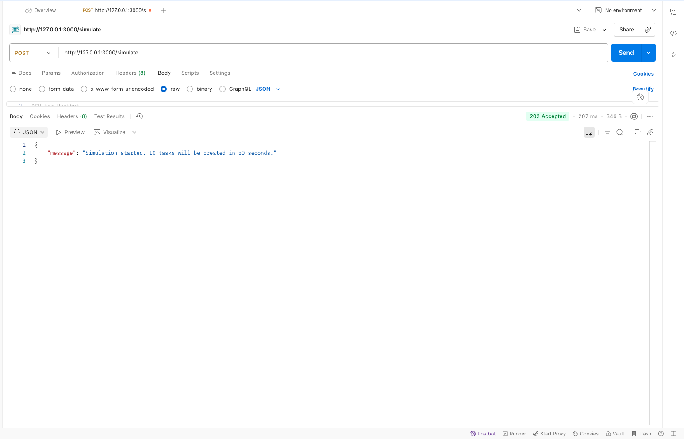

# Mately - Backend API | Gestionnaire de Tâches Collaboratif

## Introduction & Objectif du projet

Ce projet constitue la partie **Backend** du test technique. Il s'agit d'une API REST développée pour gérer un système de tâches collaboratif.

### Contexte métier
L'objectif est de permettre à plusieurs utilisateurs de créer des tâches, tout en offrant aux clients dans une applications mobiles la possibilité de récupérer les nouvelles tâches.

### Fonctionnalités principales
- **Récupération des tâches** : Endpoint permettant de retourner les tâches créées après une date donnée
- **Simulateur de création de Tâches** : Génération automatique de tâches espacées dans le temps
- **Architecture scalable** : Conçue pour supporter une montée en charge et faciliter la maintenance

---

## Architecture et Choix Techniques

### Stack Technologique
| Technologie |
|------------|
| **Node.js** |
| **TypeScript** |
| **Express** |
| **MongoDB** |
| **Mongoose** |
| **Docker** |

### Architecture en Couches (Layered Architecture)

Le projet adopte une **architecture en couches stricte** pour garantir la séparation des responsabilités et faciliter les évolutions futures :

```
src/
├── config/          # Configuration centralisée (MongoDB)
├── controllers/     # Gestion des requêtes HTTP et réponses
├── services/        # Logique métier
├── models/          # Schémas Mongoose + Interfaces TypeScript
├── routes/          # Définition des endpoints et routing
└── app.ts           # Point d'entrée de l'application
```

---

## Prérequis

Avant de lancer le projet, assurez-vous d'avoir installé :

- **Node.js** : v20.x ou supérieur ([Télécharger](https://nodejs.org/))
- **npm** ou **yarn** : Gestionnaire de paquets
- **MongoDB** : v6.x ou supérieur
- **Docker** & **Docker Compose** : Pour le lancement containerisé (optionnel)

---

## Installation et Lancement

### Méthode 1 : Lancement Local (Sans Docker)

#### Étape 1 : Cloner le repository
```bash
git clone git@github.com:Mately-tasks/Backend.git
cd Backend
```

#### Étape 2 : Installer les dépendances
```bash
npm install
```

#### Étape 3 : Configurer les variables d'environnement
Créez un fichier `.env` à la racine du projet :

```env
# Configuration MongoDB
MONGO_URI=mongodb://localhost:27017/mately_tasks

# Port de l'API
PORT=3000

```

> **Note** : Assurez-vous que MongoDB est lancé localement sur le port `27017`

#### Étape 4 : Lancer l'application en mode développement
```bash
npm run dev
```

L'API sera accessible sur : **http://localhost:3000**

---

### Méthode 2 : Lancement avec Docker (Recommandé)

#### Étape 1 : Construire et lancer les conteneurs
```bash
docker-compose up -d --build
```

Cette commande va :
- Construire l'image Docker du backend (multi-stage build optimisé)
- Lancer un conteneur MongoDB
- Démarrer l'API sur le port `3000`

#### Étape 2 : Vérifier que les conteneurs sont actifs
```bash
docker-compose ps
```

Vous devriez voir :
```
NAME                           COMMAND                  SERVICE    STATUS
mately_tasks_api          "node dist/server.js"           api        Up
mately_tasks_mongodb      "docker-entrypoint..."        mongodb      Up
```

#### Étape 3 : Consulter les logs
```bash
docker-compose logs -f api
```

#### Arrêter les conteneurs
```bash
docker-compose down
```

---

## Documentation de l'API

### Base URL
```
http://localhost:3000
```

---

### **Endpoint 1** : Récupérer les tâches

#### `GET /tasks`

Récupère les tâches créées après une date donnée (maximum 20 résultats, triées par ordre chronologique).

**Query Parameters** :

| Paramètre | Type   | Requis | Description                                      | Exemple                    |
|-----------|--------|--------|--------------------------------------------------|----------------------------|
| `after`   | string | Non    | Date ISO 8601. Retourne les tâches créées après | `2026-02-14T10:00:00.000Z` |

**Réponse (200 OK)** :
```json
{
  "success": true,
  "count": 3,
  "data": [
    {
      "_id": "65f1a2b3c4d5e6f7g8h9i0j1",
      "title": "Task 1",
      "status": "in_progress",
      "createdAt": "2026-02-14T14:23:10.450Z"
    },
    {
      "_id": "65f1a2b3c4d5e6f7g8h9i0j2",
      "title": "Task 2",
      "status": "todo",
      "createdAt": "2026-02-14T14:25:42.120Z"
    }
  ]
}
```

**Exemple de requête `curl`** :

```bash

# Récupérer uniquement les tâches créées après une date spécifique
curl -X GET "http://localhost:3000/tasks?after=2026-02-14T10:00:00.000Z"
```

---

### **Endpoint 2** : Simulateur de tâches

#### `POST /simulate`

Lance un processus qui crée automatiquement **10 tâches aléatoires**, espacées de **5 secondes** chacune.

**Body** : Aucun

**Réponse (202 Accepted)** :
```json
{
  "success": true,
  "message": "Simulation démarrée : 10 tâches seront créées (1 toutes les 5s)"
}
```


**Exemple de requête `curl`** :

```bash
curl -X POST "http://localhost:3000/simulate"
```

**Vérification** :  
Après avoir lancé la simulation, effectuez des appels `GET /tasks` toutes les 5-10 secondes pour observer l'arrivée progressive des nouvelles tâches.

---

## Captures d'écran Postman

### Test du endpoint `GET /tasks`


**Description** :  
Exemple de récupération des tâches avec le paramètre `after` pour obtenir uniquement les tâches récentes.

---

### Test du endpoint `POST /simulate`



**Description** :  
Réponse immédiate du serveur confirmant le démarrage du simulateur en arrière-plan.

---

## Tests et Validation

### Scénario de test recommandé

1. **Lancer le backend** (via Docker ou npm)
2. **Effectuer un `GET /tasks`** → Devrait retourner 0 tâche (base vide)
3. **Lancer la simulation** avec `POST /simulate`
4. **Effectuer un `GET /tasks?after=<date_première_requête>`** → Devrait retourner uniquement les nouvelles tâches
